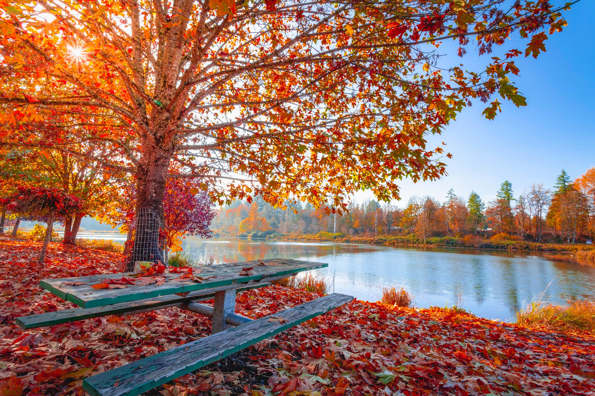
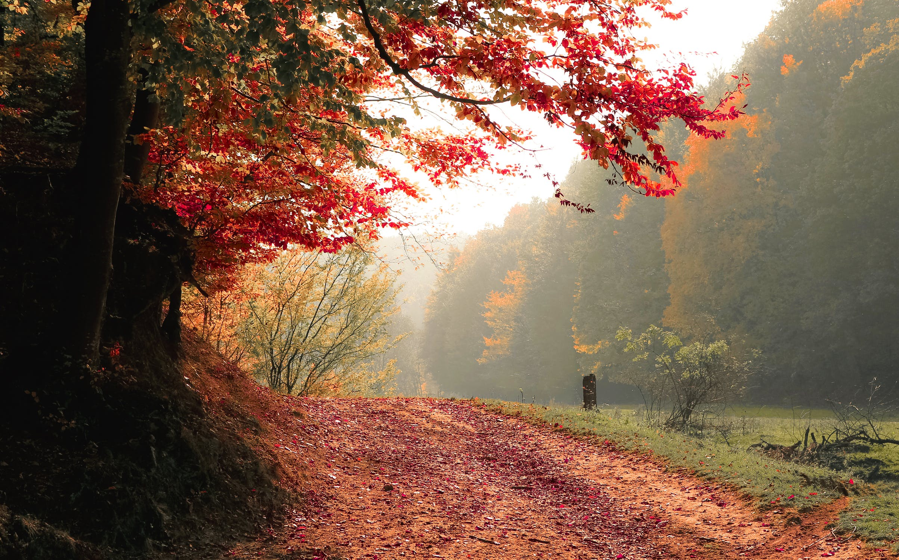

# DevOps education Program

This is the first task we had in our DevOps education Program. In this task, we are learning how to use Git and Markdown.

* This is a simple website
* It consists of two Autumn images with Autumn season quotes

1- Dancing of the autumn leaves on a surface of a lake is a dream we see when we are awake..



2- Everyone must take time to sit and watch the leaves turn..




The site was built using images from [pexels.com](https://www.pexels.com/) Website :

* [Lake in the Autumn](https://www.pexels.com/photo/red-and-orange-autumn-leaves-on-the-ground-and-on-trees-beside-body-of-water-1741696/)
* [Trees in Autumn](https://www.pexels.com/photo/red-leafed-tree-near-green-grass-589841/)

## Git commands that were used:
```
git clone
git add
git commit
git merge
git push
git log --pretty=format:'%h %ad | %s%d [%an]' --graph --date=short 
git reflog
```

## What DevOps is and why I want to become a DevOps:

DevOps is a combination of cultural philosophies, practices and tools that narrow the gap between Developers and Operations teams in order to provide continuous and smooth improvements to applications in a stable environment to have loyal and happy customers :) and this fits exactly into what I like to do!
