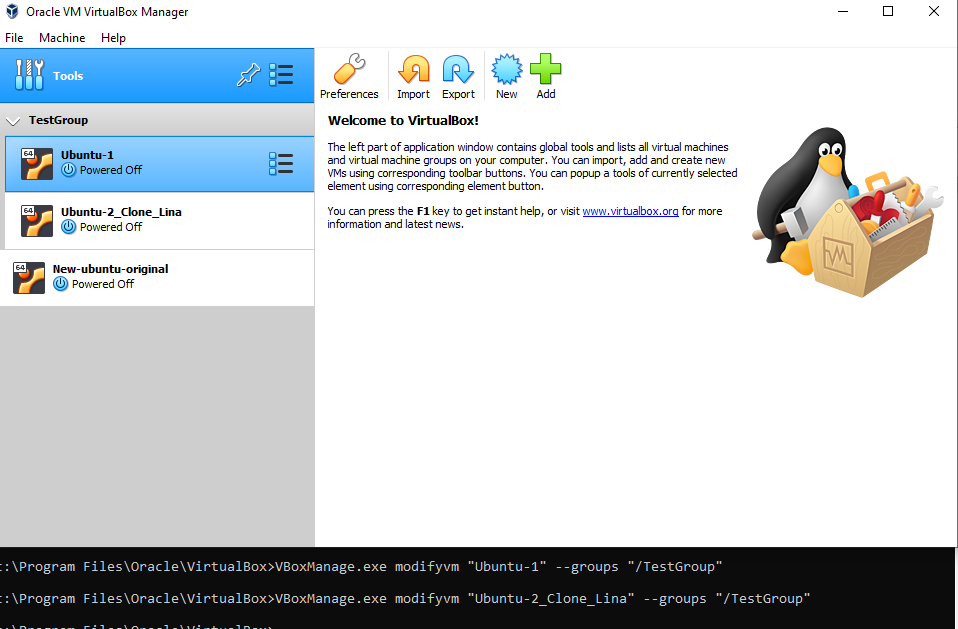
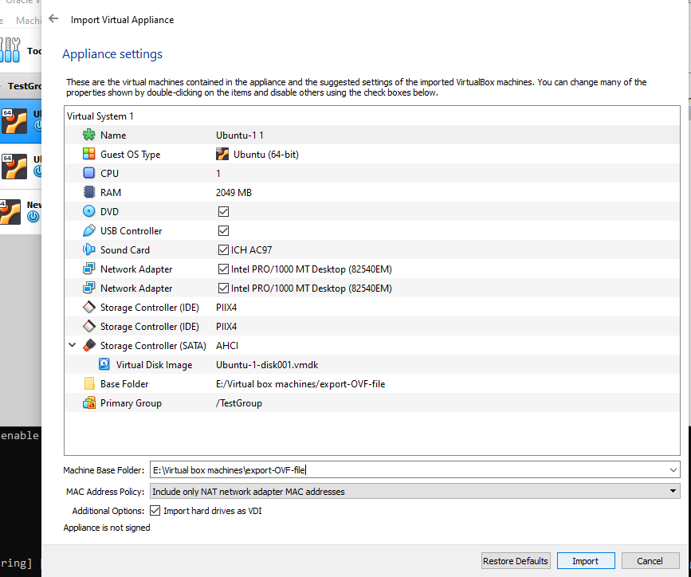
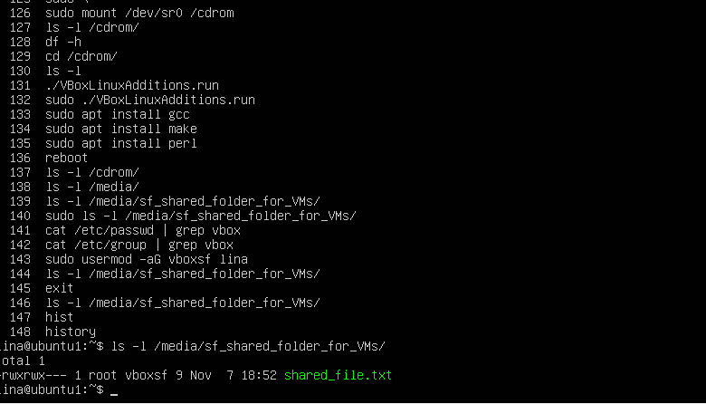
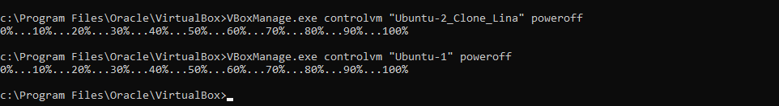
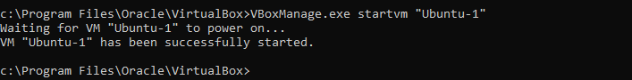
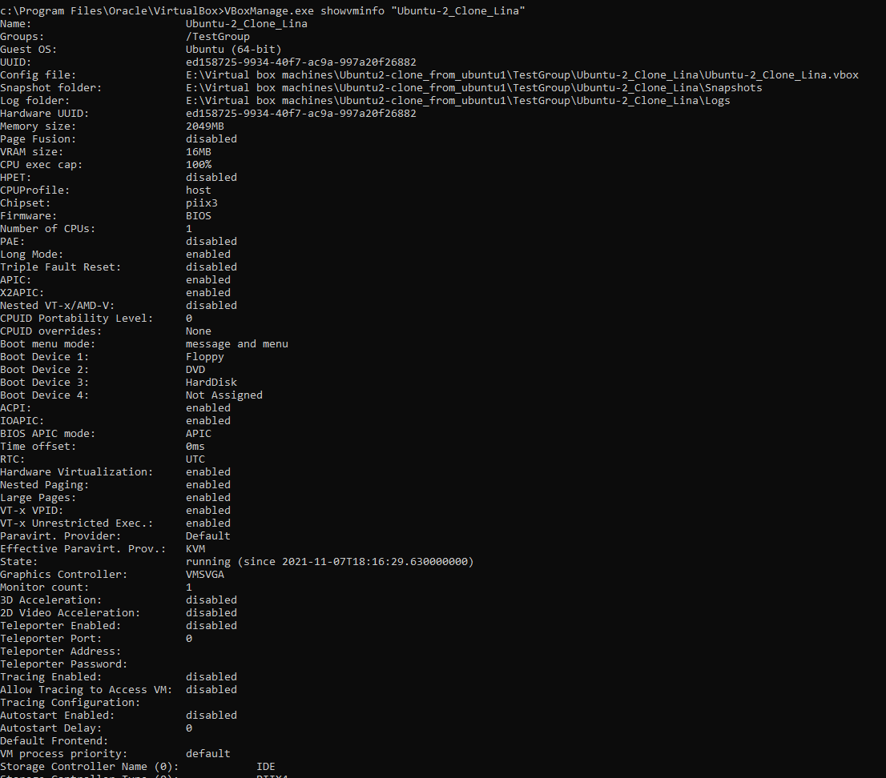
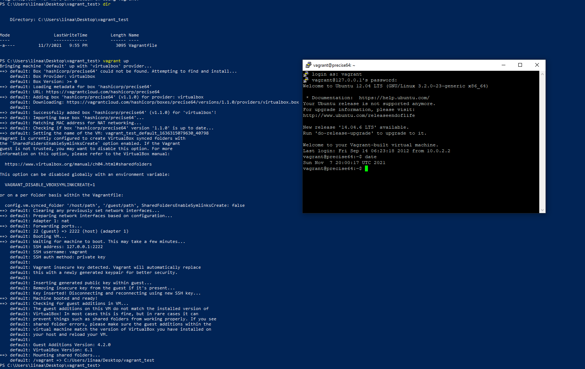

# DevOps education Program - Virtualization

This module covers virtualization and Cloud Basic.
Task 2.1 is for virtualization.

## Part 1. Hypervisors

Most popular hypervisors for infrastructure virtualization are 
1- VMware vSphere / ESXi
2- Microsoft Windows server Hyper-V
3- Xen /Citrix XenServer
4- Red Hat Enterprise Virtualization (RHEV)
5- KVM

## Part 2. Work with VirtualBox


- Cloning and creating group of two VMs: 



- Working with OVA files:



- Shared folder configuration:



- Basic commands of VBoxManage:







## Part 3. Work with Vagrant

- Working with vagrant hashicorp/precise64 box




## Creating my Vagrant box:

- This box consists of the simple website html page that I did during task1.1. ant it is running in nginx and depends on VirtualBox.
- Follow [the link](https://app.vagrantup.com/Lina-at/boxes/test) to my box in vagrant cloud
- After you run 
```
vagrant init Lina-at/test
vagrant up
```
- Uncommit port-forwarding line in vagrantfile:

config.vm.network "forwarded_port", guest: 80, host: 8080, host_ip: "127.0.0.1"
and execute 
```
vagrant reload
```
- Open the website using http://127.0.0.1:8080 in your web browser and you should see my website :)