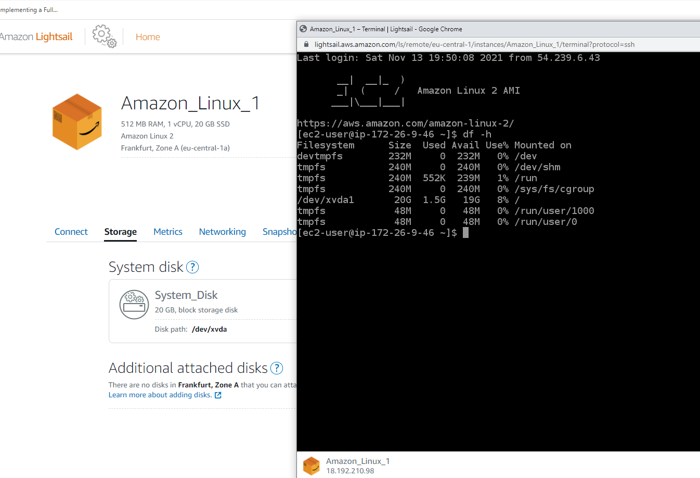
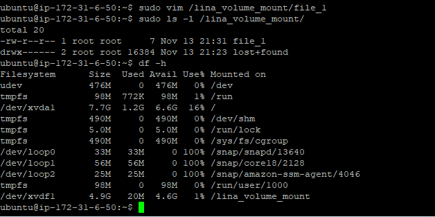
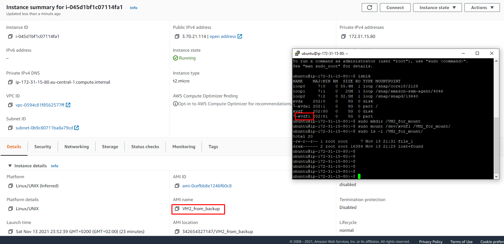

# DevOps education Program - AWS

This part from module 2 covers Clouding and particularly AWS and its services:

## Task 2.2

- Launching a Linux Virtual Machine with Amazon Lightsail depending on [guide](https://aws.amazon.com/getting-started/hands-on/launch-a-virtual-machine/):

- Launching another Linux Virtual Machine without Amazon Lightsail.

- Creating a snapshot of the instance to keep as a backup.

- Creating and attaching a Disk_D (EBS) to the instance to add more storage space. Creating and saving some file on Disk_D.

- Launching another instance from backup.

- Detaching Disk_D from the first instance and attaching it to the second instance.

- Storing and Retrieving a File in bucket S3 depending on [guide](https://aws.amazon.com/getting-started/hands-on/backup-files-to-amazon-s3/)

- Batch upload files to the cloud to Amazon S3 using the AWS CLI depending on [guide](https://aws.amazon.com/getting-started/hands-on/backup-to-s3-cli/?nc1=h_ls)

- An overview of Route53 service depending on [guide1](https://aws.amazon.com/getting-started/hands-on/launch-a-wordpress-website/?trk=gs_card) and [guide2](https://aws.amazon.com/getting-started/hands-on/get-a-domain/?nc1=h_ls)

- Building docker image depending on Dockerfile and pushing it into Elastic Container registry (ECR) depending on [guide](https://docs.aws.amazon.com/AmazonECS/latest/userguide/docker-basics.html).

- Creating a static website on Amazon S3, publicly available depending on [guide](https://docs.aws.amazon.com/AmazonS3/latest/userguide/HostingWebsiteOnS3Setup.html) containg student photo, the name of the educational program (EPAM DevOps online Autumn 2021), the list of AWS services with which the student worked within the educational program or earlier and the full list with links of completed labs (based on [tutorials](https://aws.amazon.com/getting-started/hands-on/?awsf.getting-started-content-type=content-type%23hands-on&?e=gs2020&p=gsrc&getting-started-all.sort-by=item.additionalFields.sortOrder&getting-started-all.sort-order=asc&awsf.getting-started-category=*all&awsf.getting-started-level=*all) or [qwiklabs](https://amazon.qwiklabs.com/).

[Link](http://lina-website.com.s3-website.eu-central-1.amazonaws.com) to the website.
